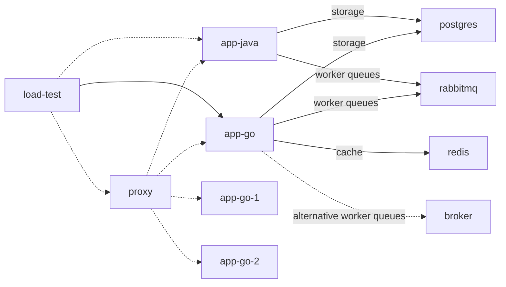

# playground

note:
1. dotted line refers to future update
2. solid line refers to what we currently have

## directory briefs

- `./.devcontainer`, contain dev-container definition. [reference to vscode's dev-container](https://code.visualstudio.com/docs/devcontainers/containers)
- `./.docker`, contain definitions/configuration to setup container in docker 
- `./.vscode`, contain repo's workspace setting for vscode
- `./app-go`, credit managements app implemented using golang
- `./broker`, an attempt to create message-broker in golang
- `./load-test`, contain scripts to execute load test scenarios

## learning points
1. learn how to make credits management doesnt go kaboom when theres huge transaction intake
   1. this covered inside `./app-go` and already fully implemented
   2. additionally I wanted to created `./app-java` just to see how it performed compared to golang one. It should contain the same spec as `./app-go`
2. learn how to utilize docker for service orchestration
3. ~~learn how to load test using `grafana/k6`, which we'll be using to run the scenario + replicate huge intake process~~
   1. this got scratched because as per writing this, we cannot meddle with `grafana/k6` directly with golang
4. build a simple load test library that has observabilities element built in it
5. visualize the observability metrics from the experiment, using:
   1. `grafana`, to visualize
   2. `cadvisor`, to scrap resource metrics from the containers
   3. `prometheus`, for `app-go` metrics
   4. `open-telemetry`, identifies bottle-necks and traces
6. utilize `rabbitmq` for message broker. I'm using this for asynchronous process.

## setup
- use vscode, reopen repo in container. Ref: [VSCode's dev-container](https://code.visualstudio.com/docs/devcontainers/containers) 
   - This help isolate the development
- to setup the whole thing, run the following command at `./` once inside dev-container
   > make start

## links
- [grafana dashboard](http://localhost:10000/d/f744f256-9d10-4e29-9dd0-c4ea6f8d7dd2/dashboard?orgId=1&var-container_name=app-go-worker&var-container_name=app-go&from=now-5m&to=now&refresh=5s) (still in work)