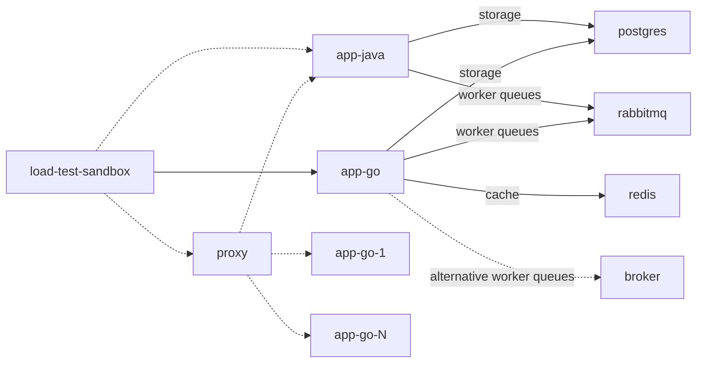

# playground

note:
1. dotted line refers to future update
2. solid line refers to what we currently have

## directory briefs

- `./.devcontainer`, contain dev-container definition. [reference to vscode's dev-container](https://code.visualstudio.com/docs/devcontainers/containers)
- `./.docker`, contain definitions/configuration to setup container in docker 
- `./.vscode`, contain repo's workspace setting for vscode
- `./app-go`, web app implemented using golang + gin-http
- `./app-java`, web app implemented using java + spring boot

## learning points
1. learn how to make credits management doesnt go kaboom when theres huge incoming request
   1. `./app-go` 
   2. `./app-java`
   3. `./app-rust` soon
   4. ~~`./app-scala`~~
      - cancelled, too complex to learn
      - removed as per [this commit](https://github.com/vembry/playground/commit/431444f6c3414f38bc3b66539f52069a023b12fa) 
2. learn how to utilize docker for service orchestration
   1. bonus: kickstart kube learning
3. stress testing
   1. ~~build a simple load test library that has observabilities element built in it~~ done
   2. run scenario
4. visualize the observability metrics from the experiment, using:
   1. `grafana`, to visualize
   2. `cadvisor`, to scrap resource metrics from the containers
   3. `prometheus`, for `app-go` metrics
   4. `open-telemetry`, identifies bottle-necks and traces
5. utilize `rabbitmq` for message broker. I'm using this for asynchronous process.

## setup
- use vscode dev-containder, reopen repo in container. Ref: [VSCode's dev-container](https://code.visualstudio.com/docs/devcontainers/containers) 
   - This help isolate the development
- to setup the whole thing once inside dev-container, run the following command at `./`:
   > make start

## links
- [grafana dashboard](http://localhost:10000/d/f744f256-9d10-4e29-9dd0-c4ea6f8d7dd2/dashboard?orgId=1&var-container_name=app-go-worker&var-container_name=app-go&from=now-5m&to=now&refresh=5s) (still in work)