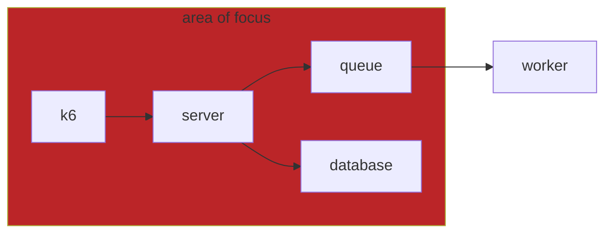
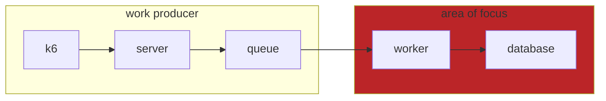

# playground

## goals

to see how a webapp behave under load test with minimum resource. rather than seeing the maximum performance of a language, the experiment focusing more on **how much a webapp can perform with minimum the resources**.

in a company, we will always wanted to maximize ROI margin and tech infrastructure is be one of the variables that can contributes this margin. to maximize the ROI we want the most performant, best dev-experience, with the lowest infra cost possible.

### outline

The test only covers APIs/backends and does not include frontends

## scenarios

we will be using overly-simplified flow of balance management to mimic real life case as the scenario.

to fulfill the basic scenario, webapp have to serve http handler and must have capabilities to become a worker to handle queues. we are using `rabbitmq` as the message broker.

webapp will serve 3 endpoints, which are:

1. `GET /balance` to check balance
2. `POST /balance/{balance_id}/deposit` to topup balance
3. `POST /balance/{balance_id}/withdraw` to withdraw balance

we utilize docker to orchestrate the webapps and it's dependencies. we also use `cadvisor`, to scrap resource metrics from the containers. webapps should also produce basic metrics in regards to it's performance. these metrics will be visualized and evaluated in `grafana`.

### scenario 1 - webapp as server

focusing on the performance of an webapp's server within constraint on handling http calls

### scenario 2 - webapp as worker (still in work)

focusing on the performance of an webapp's worker within constraint on handling work

## directory briefs

- `./.devcontainer`, contain dev-container definition. [reference to vscode's dev-container](https://code.visualstudio.com/docs/devcontainers/containers)
- `./.docker`, contain definitions/configurations to setup container in docker
- `./.vscode`, contain repo's workspace setting for vscode
- `./app-*`, web app focusing on the backend using respective language
- `./web-*`, web app focusing on the frontend using respective language
- `./k6`, contain scenario for load-test. utilizing k6
- `./compose.yml`, contain specs for docker cluster containing services and their deps
- `./compose.k6.yml`, contain specs for k6 to run, deliberately separating this file to avoid bloating the main compose file

## setup

- use vscode dev-container, reopen repo in container. Ref: [VSCode's dev-container](https://code.visualstudio.com/docs/devcontainers/containers)
  - This help isolate the development
- to setup the whole thing once inside dev-container, run the following command at `./`:

  > make start

  it will setup the docker cluster

## links

- [grafana dashboard](http://localhost:10000/d/f744f256-9d10-4e29-9dd0-c4ea6f8d7dd2/dashboard?orgId=1&var-container_name=app-go-worker&var-container_name=app-go&from=now-5m&to=now&refresh=5s) (still in work)
